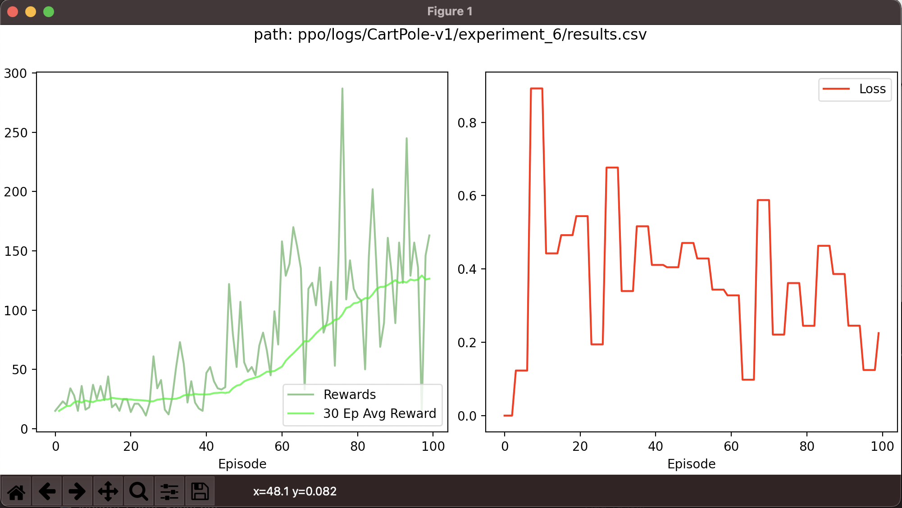
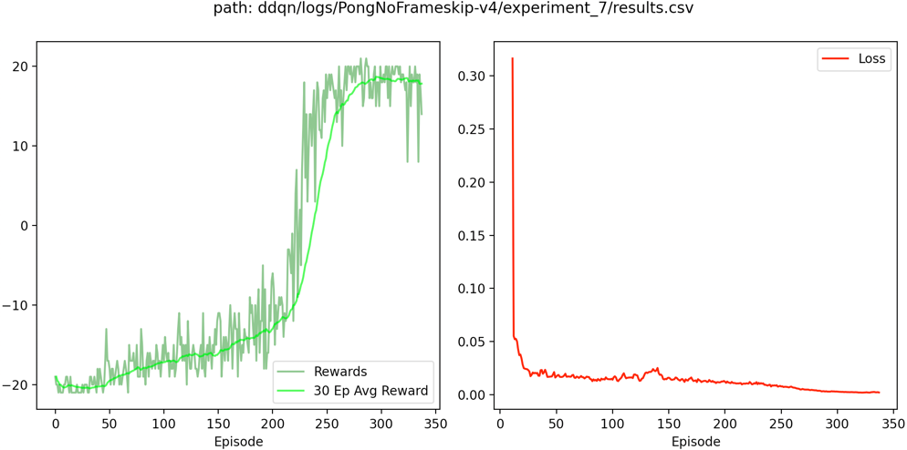

<figure>
  
</figure>


## Goals of the repo:

- Demystify RL algorithms by providing minimal, pytorch object-oriented implementations and it's accompanying pseudocode and explanation
  - I also provide quick explanations on typical `Pytorch` tricky manipulations, like `.squeeze()` or `.detach()` (at the end of repo)
- Support my theory notes
- Practice implementing algorithms

### Features:
- [Accompanying theory notes](https://alramalho.notion.site/Understanding-RL-Theory-Notes-e8591990a19e4d31bd841d318cbd6e40) 📕
- Minimal and Object Oriented code for simple (Semi Gradient Sarsa) and state of the art algorithms (PPO-Clip)
- Understandable and intuitive **logging** via experience tracking
- Easy reward and loss **plotting**
- **Hyperparameter Tuning** (in < 40 lines of code for all algorithms)*
- Intuitive **terminal interface** (in < 50 lines)

### Disclaimer:

- These implementations aren't supposed to be used in research, but for full-transparency learning. \
  As so, no testing capabilities or pre-trained models are provided.

## Algorithms

| Algorithm                                 | Lines of Code | Verified Environments                                 | 
|-------------------------------------------|---------------|-------------------------------------------------------|
| Semi Gradient Sarsa                       | < 100         | `CartPole-v1`                                         |
| Reinforce with Baseline                   | < 100         | `CartPole-v1`                                         |
| Deep Deterministic Policy Gradient (DDPG) | ~ 150         | `HalfCheetah-v2`     , `Pendulum-v1`                  |
| N Step Actor Critic                       | < 150         | `CartPole-v1`, `LunarLander-v2`                       |
| Double Deep Q Network (DDQN)              | < 200         | `CartPole-v1`, `LunarLander-v2`, `PongNoFrameskip-v4` |
| Proximal Policy Optimization (PPO)        | < 200         | `CartPole-v1`, `LunarLander-v2`, `Pendulum-v1`        |

## Usage

For a complete description run

```
pyhton run.py -h
```

### Train

```
python run.py --algo <algo> --env <env>
```

**Outputs**

```
<algorithm>
  └─logs
    └─<environment> 
      └─<experiment_id>
          ├─config.txt >> Contains agent configuration 
          ├─log.txt >> Stdout output (useful for customization)
          └─results.csv >> CSV of Rewards and Loss
```

For example running 

```
python run.py --algo ddqn --env CartPole-v1
```

will yield 
```
ddqn
  └─logs
    └─CartPole-v1 
      └─experiment_0
          ├─config.txt >> Contains agent configuration 
          ├─log.txt >> Stdout output (useful for customization)
          └─results.csv >> CSV of Rewards and Loss
```

- Running again does not overwrite, but appends new experiments `<algo>/logs/<env>` folder
- The files begin to be written as soon as the experiment starts. Hence interrupting via `CTRL`+`C` will still yield plottable results.
- You can also delete last experiment by running the same command with `-d` or `--delete` flag

### Tune / Optimize

This is mostly helpful if you plan on adding different environments.
It uses [optuna](https://optuna.org/) to run several hyperparameter combinations and picks the best.

```
python run.py --algo ddpg --env Pendulum-v1 --optimize --n-trials 100
```

**Outputs**

```
<algorithm>
  └─logs
    └─<environment>
      └─<experiment>
        └─trial_1
          ├─config.txt >> Contains agent configuration 
          ├─log.txt >> Stdout output (useful for customization)
          └─results.csv >> CSV of Rewards and Loss
        └─trial_2
          └─...
        └─...
        └─trial_<n_trials>
          └─...
```

- You can cancel it with CTRL+C
- For simplicity, all hyperparameter _suggestions_ are done in `core.optuna_create` method. I'll leave the tweaking around for you.

### Plot

Used for plotting losses and rewards

```
python run.py --algo <algo> --env <env> --plot <experiment>
```
Ex: `python run.py --algo ppo --env CarPole-v1 --plot experiment_6`

Would open
<figure>
  
</figure>
<figure>
  
</figure>


- `<experiment>` can be ommited and it will use latest experience for specified algorithm and environment.


# TODO

- [x] put pseudocde image into every folder
- [x] run every algorithm and put some graphs
- [x] Add at least 2 environments per main algorithm
- [x] unify all `train.py`
- [x] consistent signature across all algorithms
- [x] Add Atari onto DQN
- [x] add logging
    - To csv
- [x] explain folder structure
- [x] experiment manager
- [x] add no test disclaimer
- [x] separate plotting from main execution (use intermidiary csv)
- [ ] vectorized environments. (Check `stable_baselines3/common/vec_env`)
- [ ] unit tests to verify all algos work (take a look at `rl-baselines3-zoo/tests`)
- [ ] Allow for video saving
- [ ] Allow for model saving

### other improvements

- Create `Environment` class with `run_episode` code

# troubleshooting

- In case you run into ROM license troubles when running `PongNoFrameskip-v4`, run

```
pip install "gym[atari,accept-rom-license]"
```

Be aware that this accepts the ROM license for you.


## `Pytorch` tricks
- `.squeeze(...)`
  - This "squeezes" dim=1 of the array. Useful for when you're working with slightly different tensor shapes. Ex: tensor of dims [32,1].squeeze() -> [32,]  
- `.unsqueeze(...)`
  - Kind of the reverse of `.squeeze()`, as it adds in one dimension. Ex: tensor of dims [32,].unsqueeze(1) -> [32, 1]
- `.view(...)`
  - Like `.unsqueeze()` but you could do weirder manipulations (change several dimensions). Ex tensor of shape [2,2].view(4,1) -> [4,1]
- `detach()`
  - Detaches tensor from gradient calculations. Useful when you want to make predicitons, without backpropagating. (Ex: DDQN target network)
