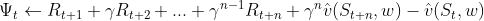

# One step advantage actor Critic

## pseudocode
```
# INITIALISE EXPERIMENT
actor_θ, critic_w ← parameterised functions instantiated as neural networks
ɑ_θ, ɑ_w ← step size for actor and critic respectively

# EXPERIMENT LOOP
for each episode in max_episodes:
    
    # INITIALISE EPISODE
    state ← start state of environment
		𝚿_record, log_probabilities, states, rewards ← []
    
    # EPISODE LOOP
    for each step in episode t=0,1,...,T:
        policy ← actor_θ(state)
        log_probabilities ← log(policy)
        next_state, reward ← environment_step(sample(policy))
        rewards ← rewards + reward
        states ← states + state
        𝚿_record ← 𝚿_record + 𝚿_function(next_state, states, rewards, critic)
        state = next_state
    endfor
   
   	# UPDATE PARAMETERS
   	loss_actor ← mean( - log_probrobabilities * 𝚿  									  																		- log_probabilities.entropy() * 0.01) # polict gradient
    loss_critic ← mean(𝚿**2) 																# mean squared error
    θ ← θ + ɑ_θ * loss_actor
    w ← w + ɑ_w * loss_actor

endfor
```


where 

